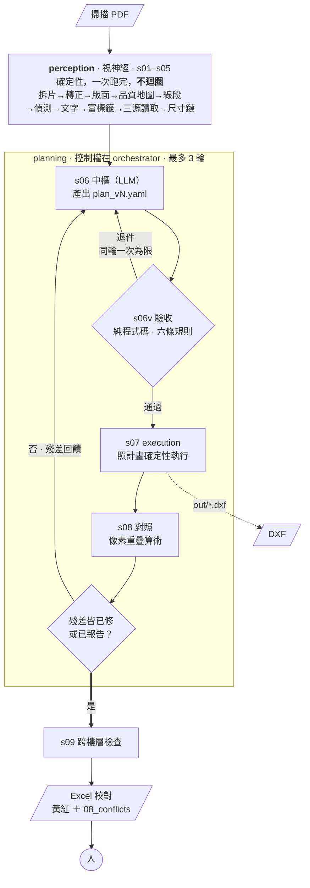

# Paper-to-BIM

**我們把民國 68 年（1979）的建照（construction license）曬圖（diazo print），重建成可用的 BIM 模型。**

> **現況：骨架（skeleton）階段。** 流程骨架與契約（contract）已經定下來，模組多數還是 stub，
> 契約三件套是待審核的草案，還沒跑過任何一件真實案件。
> 進度見下方[建造順序](#建造順序)。

---

## 我們是什麼

一套把紙本建築圖轉成電子檔的 agentic 工具。

給圖 → 影像預處理 → 多模態 LLM 判讀 → 整合成具體的繪圖指令 → 還原成電子檔案。

不是 OCR 工具，也不是「上傳圖片、下載模型」的黑箱。我們做的是一條
**看得見自己哪裡不確定**的產線 —— 它會告訴你哪一道牆是量出來的、
哪一道是依尺寸鏈推的、哪一處圖上本來就對不起來。

輸出目前是 DXF（drawing exchange format），中間每一步都落檔，每一個判斷都附得出證據。

> **輸入格式的現況要先講清楚。** 程式目前只吃**經過拼版的 PDF** ——
> 它靠 PDF 裡記錄的影像放置矩陣免去對位。單張影像與多張分次掃描的支援
> 是規劃中、尚未實作的一條路徑，設計方向見
> [ADR 0008](docs/adr/0008-輸入格式.md)（狀態 proposed，尚未拍板）。
>
> 值得一提的是：因為「**尺寸是幾何，線段只是拓樸**」，多張分次掃描的圖
> **不需要精確拼接** —— 拓樸靠視覺判讀，長度靠尺寸鏈上的數字。
> 片與片的關係打算當成中樞的一筆判斷（要附證據、要過驗收），
> 而不是視神經層的盲步驟。接不起來時它會變成一筆矛盾，不會被硬拼。

## 為何而做

建築師事務所接到室內裝修、變更使用執照、增建、改建的案子，第一件事都是同一件：
**去檔案室調出當年的建築執照圖，用印表機印出來，再由人照著對照、重新繪製一遍。**

那不是設計工作。那是把三十年前就已經存在的資訊，重新輸入一次。
慢、貴、佔掉事務所大量人力，而且**重畫的人會不自覺地把圖「修順」** ——
原圖上對不起來的地方，在重畫的過程中被無聲地抹平了。

我們想把這段工時還給設計。

### 但這件事沒有表面上簡單

一張 1979 年的曬圖掃進來：底色不均、對折處有摺痕白帶、
針筆線 0.4–0.6 mm 在 300 dpi 下只有 5–7 px、曬圖擴散後兩條平行線會糊成一條粗帶。

真正的難處不是「認不出來」，是**認錯了卻看起來很合理**：

- 尺寸標註寫 `403`，傳統 OCR 可能給你一眼看得出是垃圾的 `4O3`；
  但視覺語言模型會給你**乾淨、合理、有自信、而且錯的 `408`**
- 一道 12 cm 的內牆，兩條線只隔 14 px，糊在一起就變一條線 —— 整面內牆從模型裡消失
- 二樓 X 向的尺寸鏈加總 12200，總尺寸標的卻是 12000

**最後那一項才是我們真正在處理的問題。** 那 200 的差額，是圖上本來就有矛盾，
還是我們讀錯了？

多數自動化工具會挑一邊、把差額均攤掉，交出一個看起來很完整的模型 ——
**那等於用程式重演「重畫的人把圖修順」這個錯誤**，而且更快、更大量、更沒人察覺。

我們不做那件事。

## 實踐的方式

### 控制權在程式碼，不在 agent

迴圈次數、終止條件（termination condition）、退件（rejection）重寫，我們全部寫死在 `planning/orchestrator.py` 的
`for` 迴圈裡。中樞（LLM）只被呼叫 —— **它不能決定要不要再跑一輪**。

我們不是不信任模型，是不想讓「跑幾輪」這種事變成不可重現的。

### 腦手分離

中樞（planning）的產出是一份**繪圖計畫（drawing plan）**（YAML），不是動作。
執行那一層只讀計畫、不讀原始偵測資（test data）料。
中樞說不清楚的東西，就畫不出來 —— 這是刻意的。

### 矛盾是產出，不是障礙

對不起來的東西，我們寫進 `08_conflicts.csv`，**不挑一邊蓋掉另一邊**：

```yaml
conflicts:
  - kind: chain_closure
    detail: 二樓X向合計12200，總尺寸12000，差200
    involved: [chain#c007, read#p02_d0038]
```

**帶著矛盾收工，對我們來說是成功。** 那 200 會一路傳到人的面前。

### 不確定往上傳，不往下傳

讀數（reading）走三個**機制上獨立**的來源：OCR 的字形比對、視覺語言模型的語意理解、
以及完全不看文字、只算端點距離乘比例尺（drawing scale）的幾何推算。

第三源（three sources）是關鍵。前兩者都在認字形，會被同一個模糊的字**一起騙** ——
兩個相關的來源等於一個來源。

三源一致才自動採用；兩對一標黃；分歧或有來源讀不出來就標紅，送人工。
值未定就是未定，我們不讓它往下游傳。

> 代價我們講在前面：這套系統**不追求全自動**。
> 它追求的是「哪裡不確定，你一眼看得到」。

## 怎麼安裝

### 現在什麼都不用裝

跑骨架健檢只需要 **Python 3.10–3.14**（上下限來自 IfcOpenShell 與 rhino3dm）：

```bash
git clone https://github.com/OceanLabDesign/Paper-to-BIM.git
cd Paper-to-BIM
python3 tests/smoke.py
```

我們刻意**照建造順序分階段裝相依**，不給一份「全部裝上」的清單 ——
PaddleOCR 那類套件很重，裝了幾個月用不到。

### 先查現在缺什麼

```bash
python3 -c "
for m in ['yaml','fitz','cv2','numpy','ezdxf','ifcopenshell','rhino3dm','openpyxl']:
    try: __import__(m); print('  ✓', m)
    except ImportError: print('  ✗', m)"
```

### 需要時才裝

```bash
pip3 install pymupdf opencv-python numpy      # 第 2–3 步：拆片與影像處理
pip3 install ezdxf openpyxl                   # 第 5 步：DXF 輸出與 Excel 校對
pip3 install ifcopenshell rhino3dm            # 第 8 步與 Rhino 匯出
```

PaddleOCR-VL 留到真的要跑文字辨識時再裝（它會帶進整個 PaddlePaddle）。

### 中樞（LLM）：雲端或本地二選一

| | |
|---|---|
| 雲端 | 設 `ANTHROPIC_API_KEY` 或 `OPENAI_API_KEY`，不必裝任何東西 |
| 本地 | Ollama／vLLM／LM Studio 擇一，走同一支 OpenAI 相容轉接器（adapter） |

我們支援本地模型不只是為了省錢：**掃描圖含個資（personal data）與著作權，跑本地模型時圖不出機器。**

## 怎麼使用

一個案子一個資料夾。複製範本、把掃描 PDF 放進去，然後跑：

```bash
cp -r cases/_template cases/68-01782_某某街
cp ~/scan.pdf cases/68-01782_某某街/00_raw/
python3 -m planning.orchestrator cases/68-01782_某某街
```

每一步都讀檔寫檔，編號即順序 —— 你隨時可以停下來看中間結果，
也可以只重跑其中一步：

```
00_raw/            原始 PDF（唯讀）
01_tiles/          拆出的片，原始解析度、未轉正（可追溯用，永不覆蓋）
01_tiles_upright/  轉正後的片 ← s02 之後一律吃這個
02_sheets.csv      版面：圖種／樓層／比例／單位／方向
03_lines.csv       線段    03_texts.csv  文字    03_elements.csv  富標籤
05_chains.csv      尺寸鏈（含閉合狀態）
plans/             中樞的思考史：plan_v1.yaml → residuals_v1.csv → plan_v2.yaml …
out/               DXF
08_conflicts.csv   對不起來的東西
```

`plans/` 是我們刻意留的 —— 它是中樞**每一輪在想什麼**的完整紀錄，
不是暫存檔。出了問題要回頭查，答案在那裡。

## 結果會怎麼呈現

### 中樞寫的計畫

中樞不畫圖，它寫計畫。每一筆判斷都必須附證據 id，否則驗收（validation）會退件：

```yaml
judgments:
  - id: J001
    type: wall
    geometry: { axis_wkt: "LINESTRING(0 0, 806 0)", thickness: 24 }
    evidence: [pair#12, chain#c003]      # 必填，至少一個
    confidence: 0.9
    note: 厚度由線對間距 28px 換算

uncertain:
  - judgment: J007
    reason: 摺痕帶線證據中斷（quality#q13）
    basis: 依尺寸鏈補全，標低信心
```

驗收是**純程式碼**的閘門（gate），六條規則任一不過就退件重寫。其中兩條最要緊：
**證據 id 必須真的存在於 CSV**（不是查格式，是實際去查）、
**座標必須追溯得到尺寸鏈或量測結果**（我們禁止目測座標（eyeballed coordinates））。

### 給人看的那一份

跑完之後，低信心與矛盾會匯成一份 Excel。我們一開始不做網頁校對（review）介面 ——
Excel 先頂，人在上面改，改完的值優先於系統判讀。

### 檔名會告訴你可不可信

只要模型裡有任何一個值是從假設推來的（例如層高（floor-to-floor height）還沒從立面圖（elevation view）量到），
輸出檔名就會帶 `_draft`，而且該筆信心不超過 0.4。

**粗胚模型被誤當精確模型，是我們風險表（risk register）上的中度風險。** 檔名是最後一道防線。

## 架構



三件事這張圖刻意畫出來：**退件**那條回頭的線（驗收不過就重寫，同輪一次為限）、
**終止是一個菱形而且畫在迴圈框裡** —— 那個判斷由 `orchestrator` 的程式碼做，
不是中樞自稱「我覺得可以了」、以及最後一個節點是**人**，不是模型。

| 套件 | 角色 | 內容 |
|---|---|---|
| `core/` | 契約 | CSV 欄位、15 類偵測類別（detection class）、計畫結構、實測校準參數（measured calibration parameters） |
| `perception/` | 看 | s01–s05，確定性（determinism），不諮詢 LLM |
| `planning/` | 判斷 | orchestrator、中樞、驗收、工具箱、技能（skill）、LLM 供應商（provider）層 |
| `execution/` | 畫 | DXF／IFC／ArchiCAD／Revit／Rhino／VisualARQ 匯出器（exporter） |
| `review/` | 校對 | 跨樓層檢查（cross-storey check）、Excel 匯出 |

中樞不是只能被動接收摘要 —— 我們給了它一組**唯讀**的主動工具：
切圖親眼看、用不同參數重跑局部偵測、高解析重讀數字、
量兩個東西之間的精確距離、沿線追蹤摺痕造成的斷線、把同位置的各樓層並排比對。

## 校準

參數是**實測**出來的，不是調出來的。以 1:100、300 dpi 為例：

```
1 cm ≈ 1.181 px       24 cm 牆 ≈ 28 px       806 cm 總寬 ≈ 952 px
自適應二值化 (31, 12)  ← 我們禁用 Otsu，這組才在曬圖陰影下活得下來
```

`tests/smoke.py` 每次都會重新驗算 —— 有人「順手優化」就會紅。

## 建造順序

我們刻意讓**假中樞（fake proposer）先於真中樞（real proposer）**：迴圈、驗收、執行、對照全部先用回固定計畫的
假中樞驗通，真的接上 LLM 時只剩一個變因。

| 步 | 做什麼 | 閘門 | |
|---|---|---|---|
| 1 | 契約三件套 | — | 🟡 草案待審 |
| 2 | 拆片（tiling）與偏移量 | offsets 對得上原拼版 | ⬜ |
| 3 | 轉正（rotate upright）、品質地圖（quality map）、線段（line segment）偵測 | 疊圖（overlay）目視：牆心線（wall centerline）壓真牆 | ⬜ |
| 4 | 三源讀取與尺寸鏈閉合（closure） | 十張圖實驗 ≥ 目標正確率 | ⬜ |
| 5 | orchestrator ＋**假中樞**跑通全迴圈 | DXF 在 ArchiCAD 打得開 | ⬜ |
| 6 | 接真中樞 ＋ 兩個 sub-agent | 68 年案全頁六圖跑完 | ⬜ |
| 7 | 挑**最爛的一件案**重跑 | 爛圖也活著，才算數 | ⬜ |
| 8 | IFC 匯出 | ArchiCAD 四道牆往返測試（round-trip test）通過 | ⬜ |

## 路線圖

以下是方向，不是承諾 —— 我們連建造順序的第 1 步都還沒走完。

### 輸出格式

```
DXF  ──▶  Rhino  ──▶  Rhino + VisualARQ  ──▶  BIM（IFC / ArchiCAD / Revit）
現在      幾何實體       參數化牆柱門窗          可編輯的原生 BIM 元件
```

**DXF 先做**，因為它是門檻最低、驗收最直接的一格 —— 事務所拿到就能用，
而且「在 ArchiCAD 打得開」是一個具體到不能爭辯的閘門。

往右每一格都在換取更高的資訊密度：Rhino 給封閉實體與可追溯的物件屬性；
VisualARQ 給真正的參數化牆；到 BIM 那一格，牆知道自己是牆，門知道自己開在哪道牆上。

**代價也一格比一格重** —— VisualARQ 只有 Windows 版，Revit 要完整版授權，
ArchiCAD 建牆得靠第三方 add-on。這些我們都查證過了，細節見
[周邊程式與版權](#周邊程式與版權)。

### 輸入與圖種

目前只處理經過拼版的 PDF、只處理 A 系列建築圖。往下走：
單張掃描影像的支援、結構圖（S 系列，有梁有配筋）、水電圖（M/E）。
15 類偵測類別的設計刻意留了往後加的空間，但**沒有插隊的空間** ——
順序即 id，永不重排。

### 再往外一點

有了帶信心標記的現況模型，接得上耐震評估、都更容積試算、資產盤點、建物履歷。
關鍵在於**信心標記要跟著資料走** —— 我們把它寫進 IFC 的屬性集，不只寫在檔名。

文資與歷史建築的數位典藏也是同一個問題形狀，而且那類案子的圖往往更舊更爛，
反而最需要「不確定要留痕」這件事 —— 修復決策要有依據。

不限台灣：任何有大量紙本圖說存量、又要做數位轉換的地方，問題是一樣的。
校準參數要重測，架構不用改。

## 周邊程式與版權

### Python 套件

| 套件 | 用途 | 授權 | 取得 |
|---|---|---|---|
| **PyMuPDF** | 讀 PDF 影像的放置矩陣（transformation matrix） | ⚠ **AGPL-3.0 或 Artifex 商業授權（雙授權）** | `pip3 install pymupdf` |
| OpenCV | 二值化、霍夫轉換（Hough transform） | Apache-2.0 | `pip3 install opencv-python` |
| NumPy | 數值運算 | BSD-3-Clause | `pip3 install numpy` |
| PyYAML | 讀寫繪圖計畫 | MIT | `pip3 install pyyaml` |
| openpyxl | Excel 校對介面 | MIT | `pip3 install openpyxl` |
| ezdxf | DXF 輸出 | MIT | `pip3 install ezdxf` |
| IfcOpenShell | IFC 輸出 | LGPL-3.0-or-later | `pip3 install ifcopenshell` |
| rhino3dm | Rhino .3dm 輸出 | MIT | `pip3 install rhino3dm` |
| PaddleOCR-VL | 全圖文字辨識 | Apache-2.0 | `pip3 install paddleocr` |

> ⚠ **PyMuPDF 的授權要留意。** 它是 AGPL-3.0 或 Artifex 商業授權的雙授權，
> 而本專案是 Apache-2.0。**AGPL 是強 copyleft，而且有網路服務條款** ——
> 如果你要散布本軟體、或把它做成對外服務，AGPL 的義務會傳染到整個作品。
>
> 我們選它是因為規格指定用它讀 PDF 影像 XObject 的放置矩陣（那是免拼接（image stitching）的關鍵）。
> 若你的用途不能接受 AGPL，兩條路：向 Artifex 買商業授權，
> 或改用 pypdfium2／pypdf 這類寬鬆授權的替代品重寫 `s01_ingest`。
> **這件事我們列為待決，還沒有定案。**
>
> IfcOpenShell 的 LGPL 相對溫和：以函式庫形式呼叫、不修改它，一般不會傳染，
> 但仍請自行確認貴方的合規要求。

### 外部應用程式：一律不是必要的

DXF 與 IFC 都是**純檔案輸出**，不需要安裝任何 CAD 軟體。
以下只在你要「該軟體裡可編輯的原生牆」時才需要 ——
而且**全部不需要 API token**：

| 目標 | 需要什麼 | 授權 | 取得 |
|---|---|---|---|
| 驗 IFC | Blender 4.2+ ＋ Bonsai 外掛 | GPL（**免費**） | [blender.org](https://www.blender.org/)、[bonsaibim.org](https://bonsaibim.org/) |
| ArchiCAD | ArchiCAD 25–29 執行中 ＋ 授權 ＋ **Tapir Add-On ≥ 1.5.7** | ArchiCAD 商業；Tapir MIT（第三方） | Graphisoft；Tapir 於 GitHub |
| Revit | **Windows** ＋ Revit 完整版 ＋ pyRevit ≥ 6.5.4 | Revit 訂閱；pyRevit GPL-3.0 | Autodesk；[pyrevitlabs.io](https://pyrevitlabs.io/) |
| VisualARQ | **Windows** ＋ Rhino 8 ＋ VisualARQ 3 | 兩者皆商業授權 | McNeel；Asuni |

幾件我們查證過、值得先知道的事：

- **AutoCAD 這條路就是 DXF。** 不需要另外的匯出器，也不需要 Autodesk 授權
- **ArchiCAD 官方 API 建不了牆** —— 74 條命令裡沒有 `CreateWalls`，
  所以 Tapir 是硬相依（hard dependency），不是選配。它是社群專案，Graphisoft 沒有正式背書，
  裝進客戶端之前請確認貴方的合規要求
- **Revit LT 沒有 API** —— 用 LT 的話這條路整個不成立
- **VisualARQ 只有 Windows 版**（官方原文「It only works on Windows.」），
  90 天試用到期後連儲存 VisualARQ 物件都會停用
- 整份清單裡**唯一真的需要 API 憑證**的是 Autodesk Platform Services（雲端 Revit），
  我們不實作它

細節見規格 §8.1 與 `execution/exporters/` 各支的 docstring。

## 不做的事

我們刻意不做什麼，跟做什麼一樣能說明這個專案：

- ❌ 把迴圈控制交給 agent（含「讓中樞自己決定要不要再跑一輪」）
- ❌ 中樞直接寫 CSV 或直接呼叫繪圖函式庫 —— 它只准產計畫
- ❌ 把數百條線段的原始資料塞進中樞脈絡（context） —— 給摘要，細節靠工具
- ❌ 為了收斂挑一邊蓋掉另一邊 —— 殘差（residual）處理只有「改判斷」或「升級成矛盾」
- ❌ 一開始就上資料庫、做網頁校對介面、追求全自動

## 文件

| | |
|---|---|
| [`docs/程式設計_v0.4.md`](docs/程式設計_v0.4.md) | 規格書。唯一依據，實作與它衝突時以它為準 |
| [`docs/術語對照.md`](docs/術語對照.md) | 專有名詞的中英對照。文件裡的括號註記都出自這張表 |
| [`docs/adr/`](docs/adr/) | 架構決策紀錄（Architecture Decision Record, ADR） —— 當初有哪些選項、為什麼選這個、**放棄了什麼** |
| [`CLAUDE.md`](CLAUDE.md) | 給 Claude Code 的工作準則與導航 |
| [`cases/_template/`](cases/_template/) | 案件資料夾範本 |

案件資料（掃描圖、中間產物、輸出）**不進版控** ——
原始 PDF 可能含個資與著作權，其餘都能從原始 PDF 重生。

## 授權

本專案採 [Apache License 2.0](LICENSE)。

第三方相依各有其授權，見上方[周邊程式與版權](#周邊程式與版權)；
**其中 PyMuPDF 的 AGPL 條款請務必先確認**是否符合你的用途。
